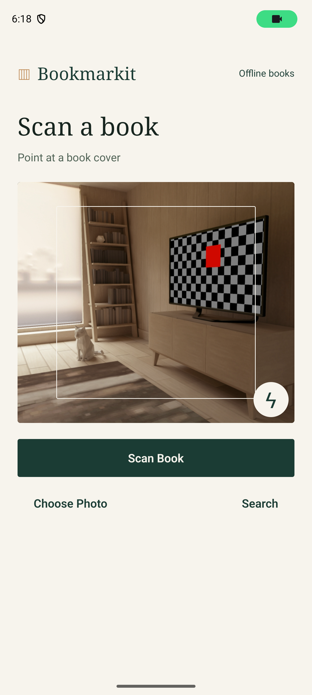
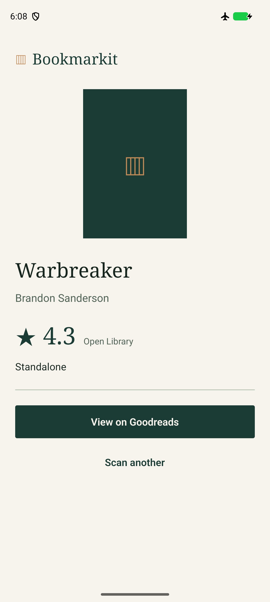
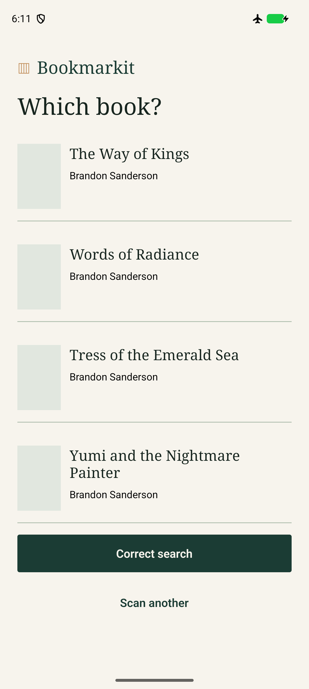
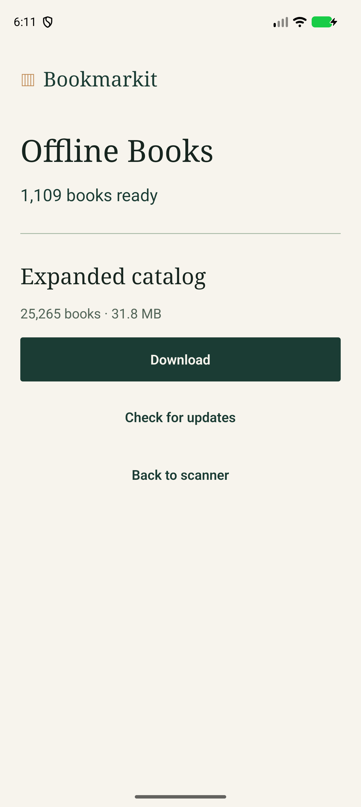

# Bookmarkit V2 validation

## Implemented

- Concurrent Supabase/Open Library/Google Books lookup, optional exact-ISBN Hardcover, immediate local results and guarded enrichment.
- On-device OCR and barcode recognition, compact ambiguity selection and Goodreads redirects.
- Editorial native UI, reusable controls, safe areas, keyboard handling, responsive camera and legible system bars.
- Existing Supabase project schema, read-only public access, imported works/editions/authors/ISBNs/ratings, ingestion history and published manifest.
- Actual optional SQLite package, checksum/integrity/count checks, atomic pointer installation, cancellation/retry, deletion and bundled fallback.
- Bounded monthly dump refresh workflow and trusted publication script.
- Permanent zero-cost Gemini adapter with independently authorized projects, shared quotas, billing/key/model verification, deduplication, cooldown and no paid/rotation fallback. Live use remains disabled.

## Local and hosted evidence

Mobile tests: **77 passed**. Server tests: **28 passed**, including eight fixture tests for free Gemini. Bundled catalog tests: **4 passed**. Expanded integrity, real ISBNs, edition linking, manifest hash and count validation passed. Typecheck, lint and SDK dependency compatibility passed.

Expanded snapshot: **25,265 works, 25,265 editions, 26,464 ISBNs; 31,838,208 bytes**. It has **1,703 rated works** and **4,160 works with resolved authors**. The bulk import uses actual monthly Open Library metadata/ratings, with a bounded partial author pass. See [catalog operations](CATALOG.md) for coverage and limits.

Local warm real ISBN hits measured median **0.38 ms**, p95 **1.12 ms**. These are Windows SQLite measurements. One hosted catalog ISBN request took **1.63 s** including connection/network setup; a title request took **0.53 s**. These single observations are not scan-to-result benchmarks or provider SLA claims.

Supabase schema and snapshot are deployed to `xxijxuekfsxuzhnujqem`. Live ISBN/title RPC searches return the imported book. Public catalog SELECT returns 200; public writes, ingestion records and usage records return 401. Security advisor has no warnings; four INFO notices describe intentional RLS-with-no-public-policy private tables. Durable free quota/pacing/global-circuit assertions passed in a rolled-back transaction. The deployed Gemini endpoint returns disabled without credentials; no live Gemini generation is claimed.

## Native Android evidence

The final local x86_64 release APK passed the recorded Android acceptance checks: real cover OCR offline and online; multiline cover OCR; manual title/author and ISBN-10; ambiguous matches; Goodreads title redirect; expanded download and native checksum/SQLite validation; a real unrated expanded book while disconnected; deletion and bundled fallback; system picker cancellation; and camera permission/preview. Final picker/camera checks were resumed against the identical SHA after adapting the test to Android's current system picker. The report records that earlier harness failure rather than hiding it.

The local APK SHA is `cfad312b0e94f0473386cdbcc7bacfaf6d0cddb1fd62b7f4d2b5fad2a6a09698`. A separate layout run passed at **360×640 dp and 130% text size**, with the longest bundled collection title and an accessible Goodreads action after scrolling. Screenshots were inspected; the cramped placeholder title was replaced, permission contrast increased, camera height made adaptive and status-bar text fixed.

Windows builds require a short checkout path because the existing native gesture-handler CMake paths exceed 260 characters in the regular repository path. No desktop machine settings were changed. The standalone build includes its JS bundle and on-device OCR model assets and launches without Metro. Emulator size/font settings used for layout checks were restored.

The fresh universal cloud APK was built at commit `1d38a9c` in [run 38029350016](https://github.com/Juvialski/Bookmarkit/actions/runs/38029350016). [Download APK artifact](https://github.com/Juvialski/Bookmarkit/actions/runs/38029350016/artifacts/11661309232). Its SHA is `e758adc12c69452580ab041e8d8c11f650f9a14dc745c59fafd14a9c52ec92e6`. Later mobile changes only add header wrapping; later backend/harness fixes are separate. This artifact is not claimed as an exact final PR-head build. The PR workflow builds that head afresh.

The first cloud native run failed because a cold emulator reconnected its radio. After reasserting offline mode after installation, the next cloud run passed offline OCR and stopped at a fresh browser's onboarding instead of the intended URL. The harness now initializes that disposable emulator browser without an account and checks the application redirect again. The corrected [cloud native run 38031286867](https://github.com/Juvialski/Bookmarkit/actions/runs/38031286867) **passed**, including baseline APK upgrade and all recorded native acceptance steps, using the universal APK from the earlier build. The static PR CI checks also passed; the fresh final-head APK build is separate.

| Scanner | Result | Ambiguous matches | Offline books |
|---|---|---|---|
|  |  |  |  |

Machine-readable reports: [native](evidence/v2/native-report.json), [layout](evidence/v2/layout-report.json), [hosted lookup](evidence/v2/live-catalog.json), [permissions](evidence/v2/supabase-permissions.json). Deliberate corruption/cancel injection has not been performed in the production-image local emulator; normal native integrity checks and deletion/fallback are verified. Those recovery safeguards are implemented, but broader fault-injection acceptance is not claimed.

## Configuration and remaining limits

- Configure `BOOKMARKIT_SUPABASE_SERVICE_ROLE_KEY` in GitHub to enable unattended monthly publication. The workflow and artifacts are implemented; an unattended monthly production refresh is not claimed.
- Configure verified authorized free Google projects and a read-only billing/key verifier through server secrets before enabling optional Gemini. [Exact variables and instructions](FREE-GEMINI.md). Missing credentials do not block normal scanning or tests.
- Live Gemini grounding and its returned presentation cannot be accepted without eligible credentials. Fixture behavior is tested. Goodreads ratings are not scraped or inferred; verified other-source ratings and Goodreads links remain the main flow.
- Canva references could not be opened; the provided palette/editorial direction was used.
- Native iOS and physical-phone camera accuracy have not been tested.
